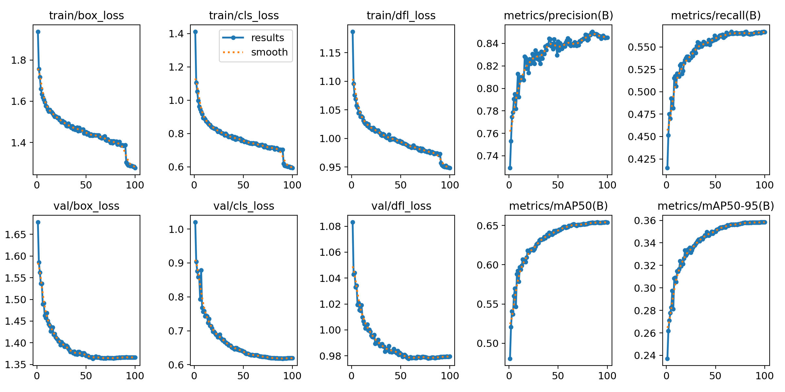
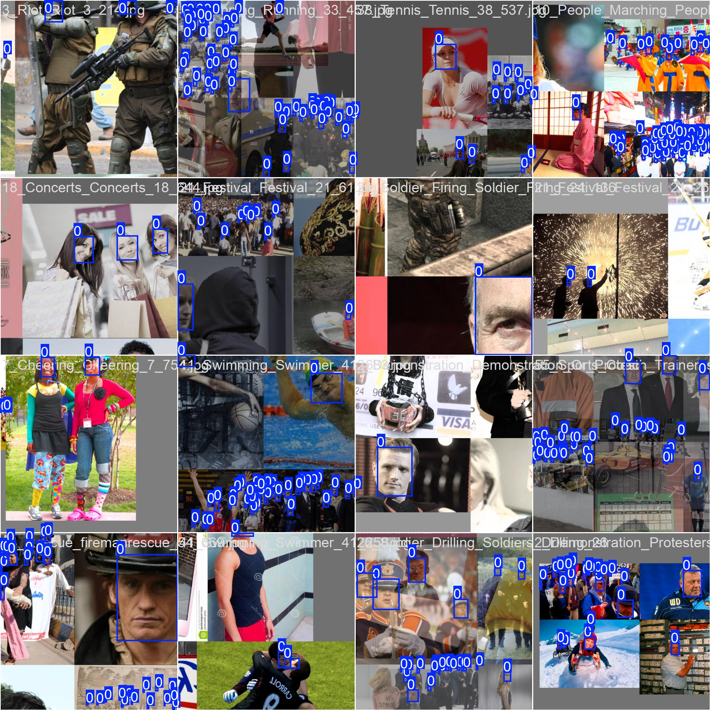
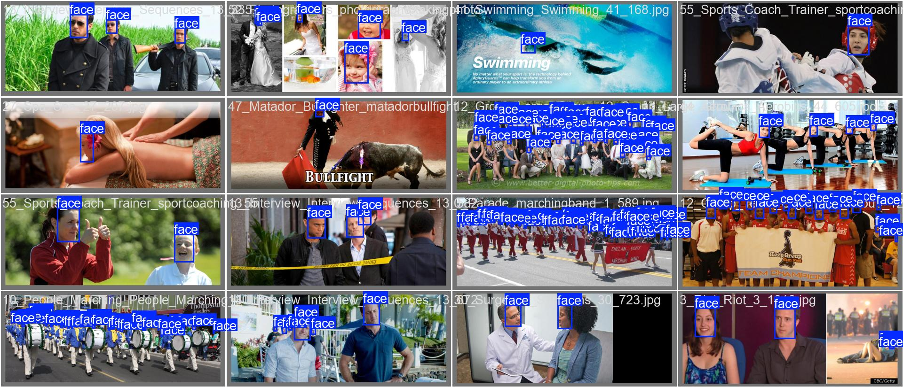

<p align="center">
  
</p>

# 🐺 CerberusFace-YOLOv8: High-Accuracy Face Detection  

**CerberusFace-YOLOv8** is a fine-tuned face detection model based on **YOLOv8 Nano**, optimized for detecting **small, distant, or low-resolution faces** in challenging real-world conditions (CCTV, surveillance, crowd monitoring, etc.).  

Trained on the **WIDER FACE dataset**, this model balances **speed and accuracy**, with added features like real-time zoom, auto/click crop saving, and easy deployment.  

---

## 🚀 Features  

✅ Detects **multiple small & distant faces**  
✅ Real-time **Auto & Click-to-Zoom modes**  
✅ **Save cropped faces** automatically to disk  
✅ Works with **webcam or video input**  
✅ Includes **training visualizations and metrics**  
✅ Exportable to **ONNX** for deployment on edge devices  

---

## 🎥 Demo (Before vs After)  

<p align="center">
  
  
</p>  

- Left: **Raw input video** (4 sec)  
- Right: **Detected faces with bounding boxes (CerberusFace-YOLOv8)**  

---

## 🧠 Training Summary  

| Parameter        | Value                  |
|------------------|------------------------|
| Base Model       | YOLOv8n (Nano)         |
| Dataset          | WIDER FACE             |
| Epochs           | 200                    |
| Image Size       | 640x640                |
| Batch Size       | 16                     |
| Optimizer        | AdamW                  |
| Augmentations    | Mosaic, MixUp, CopyPaste |
| Loss Weights     | box: 7.5, cls: 0.5, dfl: 1.5 |

---

## 📊 Training Results  

### 🔻 Loss & Metric Curves  
<p align="center">
  
</p>  

📌 Highlights:  
- Smooth decrease in box, cls, and DFL loss  
- **Precision: ~0.85**, **Recall: ~0.57**  
- **mAP@0.5 ≈ 0.64**, **mAP@0.5:0.95 ≈ 0.36**  

---


### 🎨 Sample Training Batches  
<p align="center">
  
</p>  

Example of how the model "saw" faces during training.  

---

### 🎯 Validation Results  
<p align="center">
  
</p>  

Detection results on validation samples — robust performance in dense/crowded scenes.  

---

## 🛠️ Inference  

Run face detection with:  


python Scripts/Inference.py --source 0 --mode auto --save

**Arguments:**  

- `--source` → Webcam index or video path  
- `--mode` → `auto` (all faces) or `click` (select face with mouse)  
- `--save` → Save cropped faces into `face_data/`  

---

## 📂 Repository Structure  
```
datasets/
  └── data.yaml
Model/
  ├── results 
     └──  cerberusface_yolov8n.pt
  ├── weights
    └──  confusion_matrix.png
    ├── results.png
    ├── train_batch.jpg
    └── val_batch_labels.jpg
Scripts/
  ├── Inference.py
  └── train.py
media/
  ├── before.gif             
  └── after.gif              
Requirements.txt
README.md
LICENSE

```
---

## 👥 Credits & Contributions  

- **Base Model:** Ultralytics YOLOv8 (GPL-3.0 License)  
- **Dataset:** WIDER FACE  
- **Project Author:** [Ajay Bharathi](https://www.linkedin.com/in/ajay-bharathi/), [Sridhar.S](https://www.linkedin.com/in/sridhar-s-44099425a/)   
- **Organization:** Cryptarchs  
- **Contributors:** Open for community contributions!  

📩 Contact: Open issues or PRs for suggestions and improvements.  

---

## 📜 License  

This project is released under the **GPL-3.0 License**.  
You are free to use, modify, and redistribute it, provided that derivative works also remain open-source under GPL-3.0.  

For full license terms, see the [LICENSE](LICENSE) file.  

---

## 🌟 Future Work  

🔹 Improve recall with larger models (YOLOv8m/s)  
🔹 Add multi-class face attributes (e.g., mask/no-mask, emotion detection)  
🔹 Optimize for mobile & edge deployment  
🔹 Integrate with live CCTV pipelines  

---

## 💡 How to Contribute  

1. Fork the repository  
2. Create your feature branch (`git checkout -b feature/your-feature`)  
3. Commit your changes (`git commit -m 'Add some feature'`)  
4. Push to the branch (`git push origin feature/your-feature`)  
5. Open a Pull Request  

---

🔥 With **CerberusFace-YOLOv8**, you get a **fast and accurate face detection model**, fine-tuned for the **real world**.  

