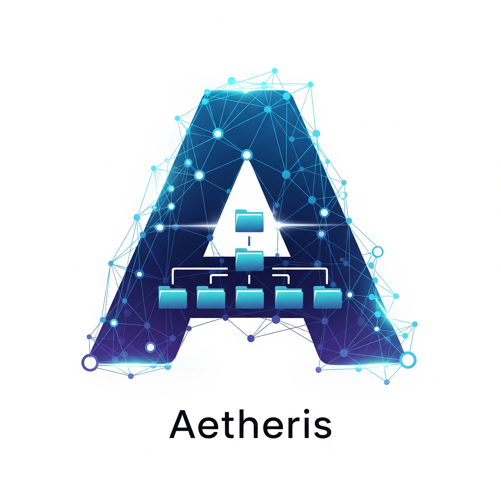

# Aetheris IBM Agent - VS Code Extension

<div align="center">



**🤖 AI-Powered Python Project Refactoring with IBM Watsonx.ai**

[](https://github.com/Ajayace03/Aetheris-ibm-agent-agent-vscode)
[](LICENSE)
[](https://www.ibm.com/watsonx)

Transform chaotic Python codebases into beautifully structured, professionally documented projects with the power of AI.

</div>

## 🌟 Overview

Aetheris IBM Agent is a revolutionary VS Code extension that leverages IBM Watsonx.ai to automatically analyze, restructure, and document your Python projects. Whether you're dealing with messy legacy code, experimental notebooks scattered everywhere, or just want to establish best practices, Aetheris transforms your project into a clean, professional codebase.

### ✨ Key Features

- **🔍 Intelligent Analysis**: Deep AST-based code analysis with dependency mapping
- **🏗️ Smart Restructuring**: AI-driven project organization tailored to your persona
- **📝 Auto-Documentation**: Comprehensive README, workflow guides, and inline documentation
- **🔧 Import Refactoring**: Automatic import path fixing for multi-language projects
- **🧪 Quality Assurance**: Built-in smoke testing and validation
- **🚀 Multi-Language Support**: Python, JavaScript, TypeScript, React, Vue.js, and more
- **🎯 Persona-Driven**: Customized structures for Developers, Data Scientists, Researchers, and Students

## 🎬 Demo


*Watch Aetheris transform a messy project into a professional codebase in minutes*

## 🚀 Quick Start

### Prerequisites

- VS Code 1.85.0 or later
- Python 3.8+ installed on your system
- IBM Watsonx.ai account with API access

### Installation

1. **Install from VS Code Marketplace**
   - Open VS Code
   - Go to Extensions (Ctrl+Shift+X)
   - Search for "Aetheris IBM Agent"
   - Click Install

2. **Configure IBM Watsonx.ai Credentials**
   - Open VS Code Settings (Ctrl+,)
   - Search for "AI Project Refactorer"
   - Enter your IBM credentials:
     - **IBM API Key**: Your Watsonx.ai API key
     - **IBM URL**: Your Watsonx.ai endpoint (default: https://us-south.ml.cloud.ibm.com)
     - **IBM Project ID**: Your Watsonx.ai project ID

3. **Set Python Path** (Optional)
   - Configure the Python executable path if not in your system PATH
   - Example: `C:\Python39\python.exe` or `/usr/local/bin/python3`

### Getting Your IBM Credentials

1. Visit [IBM Watsonx.ai](https://www.ibm.com/watsonx)
2. Create an account or log in
3. Navigate to your project dashboard
4. Generate an API key from the "Manage" → "Access (IAM)" section
5. Copy your Project ID from the project settings

## 🎯 Usage

### Basic Workflow

1. **Open Your Project**
   - Open the Python project folder you want to refactor in VS Code

2. **Launch Aetheris**
   - Open Command Palette (Ctrl+Shift+P)
   - Type "AI Agent: Start New Project Refactoring"
   - Press Enter

3. **Configure Your Refactoring**
   - **Persona**: Select your role (Developer, Data Scientist, Researcher, Student)
   - **Pain Points**: Describe current issues (e.g., "messy imports, no structure")
   - **Use Cases**: What should the agent do (e.g., "create src folder, add docs")
   - **Success Metrics**: How you'll measure success

4. **Let AI Work Its Magic**
   - Aetheris runs through 3 intelligent phases
   - Monitor progress in the "AI Agent" output panel
   - Review results in the generated `structured_project/` folder

### The Three Phases

#### 🔍 Phase 1: Discovery & Strategy
- Analyzes your project structure and dependencies
- Identifies pain points and optimization opportunities
- Generates a strategic refactoring plan tailored to your persona

#### 🏗️ Phase 2: Execution & Refactoring
- Creates organized directory structure
- Moves files to appropriate locations with intelligent reasoning
- Refactors imports across Python, JavaScript, TypeScript, React, and Vue files
- Generates dependency files (requirements.txt, package.json)

#### 📝 Phase 3: Documentation & Verification
- Creates professional README and workflow documentation
- Generates missing critical files (__init__.py, .gitignore, setup.py)
- Runs smoke tests to validate the restructured project
- Provides comprehensive reports and metrics

## 🎨 Persona-Driven Structures

Aetheris adapts its refactoring strategy based on your selected persona:

### 👨‍💻 Developer
```
project/
├── src/
│   ├── api/
│   ├── core/
│   ├── utils/
│   └── components/
├── tests/
├── docs/
└── assets/
```

### 📊 Data Scientist
```
project/
├── data/
│   ├── raw/
│   ├── processed/
│   └── final/
├── notebooks/
├── src/
├── models/
└── results/
```

### 🔬 Researcher
```
project/
├── experiments/
├── src/
├── data/
├── results/
├── papers/
└── scripts/
```

### 🎓 Student
```
project/
├── src/
├── assignments/
├── practice/
├── resources/
└── docs/
```

## ⚙️ Configuration

### Extension Settings

Access these settings via VS Code Settings (Ctrl+,) → Extensions → AI Project Refactorer:

| Setting | Description | Default |
|---------|-------------|---------|
| `ai-project-refactorer.ibmApiKey` | Your IBM Watsonx.ai API Key | `""` |
| `ai-project-refactorer.ibmUrl` | IBM Watsonx.ai endpoint URL | `"https://us-south.ml.cloud.ibm.com"` |
| `ai-project-refactorer.ibmProjectId` | Your IBM Watsonx.ai Project ID | `""` |
| `ai-project-refactorer.pythonPath` | Path to Python executable | `"python"` |

### Configuration Example

```json
{
  "ai-project-refactorer.ibmApiKey": "your-api-key-here",
  "ai-project-refactorer.ibmUrl": "https://us-south.ml.cloud.ibm.com",
  "ai-project-refactorer.ibmProjectId": "your-project-id",
  "ai-project-refactorer.pythonPath": "/usr/local/bin/python3"
}
```

## 🛠️ Advanced Features

### Multi-Language Support

Aetheris intelligently handles various file types:

- **Python**: `.py`, `.pyx`, `.pyi`
- **JavaScript**: `.js`, `.mjs`, `.cjs`
- **TypeScript**: `.ts`, `.tsx`
- **React**: `.jsx`, `.tsx` (with React detection)
- **Vue.js**: `.vue`
- **Web**: `.html`, `.css`, `.scss`
- **Data**: `.csv`, `.json`, `.parquet`
- **Config**: `.yaml`, `.toml`, `package.json`

### Intelligent Import Refactoring

Aetheris automatically fixes:
- Relative imports between moved Python modules
- ES6 imports in JavaScript/TypeScript files
- React component imports
- Vue.js component references

### Dependency Management

Automatically generates and maintains:
- `requirements.txt` with pinned versions
- `package.json` with discovered dependencies
- `setup.py` for package distribution
- `.gitignore` with sensible defaults

## 📊 Output Structure

After refactoring, you'll find:

```
structured_project/
├── [Your organized source code]
├── _project_reports/
│   ├── refactoring_report.json
│   └── README.md
├── README.md (AI-generated)
├── PROJECT_WORKFLOW.md
├── requirements.txt
└── [Generated config files]
```

## 🔍 Troubleshooting

### Common Issues

**❌ "Python not found" Error**
- Ensure Python is installed and accessible
- Set the correct Python path in extension settings
- Try using the full path to your Python executable

**❌ "IBM API Authentication Failed"**
- Verify your API key is correct and active
- Check that your Project ID matches your Watsonx.ai project
- Ensure your IBM account has sufficient credits

**❌ "Agent process failed"**
- Check the "AI Agent" output panel for detailed error messages
- Ensure your project folder contains Python files
- Verify you have write permissions in the project directory

**❌ "Virtual environment creation failed"**
- Ensure Python has the `venv` module installed
- Try running `python -m venv test` manually to verify
- Consider using a different Python installation

### Debug Mode

Enable verbose logging by:
1. Opening the "AI Agent" output panel
2. Running the extension
3. Checking detailed progress and error messages

## 🤝 Contributing

We welcome contributions! Here's how to get started:

### Development Setup

1. Clone the repository
```bash
git clone https://github.com/Ajayace03/Aetheris-ibm-agent-agent-vscode.git
cd Aetheris-ibm-agent-agent-vscode
```

2. Install dependencies
```bash
npm install
```

3. Open in VS Code and press F5 to launch the extension in debug mode

### Project Structure

```
aetheris-ibm-agent/
├── src/
│   └── extension.ts          # Main extension logic
├── agent/
│   ├── phase1.py            # Discovery & strategy
│   ├── phase2.py            # Execution & refactoring
│   ├── phase3.py            # Documentation & verification
│   ├── run_agent.py         # Orchestrator script
│   └── requirements.txt     # Python dependencies
├── package.json             # Extension manifest
└── README.md               # This file
```

### Making Changes

1. Create a feature branch
2. Make your changes
3. Test thoroughly with various project types
4. Submit a pull request with a clear description

## 📈 Roadmap

### Version 1.1.0
- [ ] Support for more programming languages (Go, Rust, Java)
- [ ] Integration with popular Python frameworks (Django, Flask, FastAPI)
- [ ] Custom refactoring templates
- [ ] Project health scoring and recommendations

### Version 1.2.0
- [ ] Team collaboration features
- [ ] CI/CD pipeline generation
- [ ] Docker containerization support
- [ ] Integration with popular project management tools

### Version 2.0.0
- [ ] Support for other AI providers
- [ ] Visual project structure editor
- [ ] Real-time refactoring suggestions
- [ ] Performance optimization recommendations

## 📜 License

This project is licensed under the MIT License. See the [LICENSE](LICENSE) file for details.

## 🙏 Acknowledgments

- **IBM Watsonx.ai** for providing the powerful AI capabilities
- **VS Code Extension API** for the excellent development platform
- **LangChain** for the robust AI integration framework
- **LibCST** for advanced Python code transformation
- The open-source community for inspiration and feedback

## 📞 Support

### Getting Help

- 📖 **Documentation**: Check this README and the [Wiki](https://github.com/Ajayace03/Aetheris-ibm-agent-agent-vscode/wiki)
- 🐛 **Bug Reports**: [Create an issue](https://github.com/Ajayace03/Aetheris-ibm-agent-agent-vscode/issues)
- 💡 **Feature Requests**: [Start a discussion](https://github.com/Ajayace03/Aetheris-ibm-agent-agent-vscode/discussions)
- 📧 **Contact**: [cryptarchs@example.com](mailto:cryptarchs@example.com)

### Community

- 💬 **Discord**: [Join our community](https://discord.gg/aetheris)
- 🐦 **Twitter**: [@AetherisAI](https://twitter.com/AetherisAI)
- 📺 **YouTube**: [Aetheris Tutorials](https://youtube.com/@aetheris)

---

<div align="center">

**Made with ❤️ by the Cryptarchs Team**

*Transform your code, transform your productivity*

[⭐ Star us on GitHub](https://github.com/Ajayace03/Aetheris-ibm-agent-agent-vscode) | [📦 VS Code Marketplace](https://marketplace.visualstudio.com/items?itemName=cryptarchs.aetheris-ibm-agent) | [🌐 Website](https://aetheris.ai)

</div>
